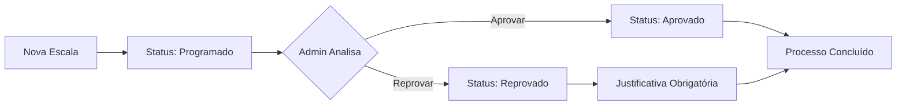

# Instruções: Implementação de Status e Justificativa nas Escalas Médicas

## 📋 Resumo da Funcionalidade

Foi implementado um sistema completo de aprovação/reprovação para escalas médicas com os seguintes atributos:

- **Status**: Programado (padrão), Aprovado, Reprovado
- **Justificativa**: Campo obrigatório quando status = Reprovado
- **Rastreamento**: Registro de quem e quando alterou o status
- **Detalhes Completos**: Diálogo com todas as informações da escala

### Características:
✅ Apenas **administradores** podem alterar o status
✅ Status "Programado" é atribuído automaticamente ao criar uma nova escala
✅ Justificativa obrigatória para status "Reprovado"
✅ Registro automático do usuário que alterou o status
✅ Registro automático da data/hora da alteração
✅ UI moderna com chips coloridos e interativos
✅ Tooltip mostrando justificativa para usuários não-admin
✅ **NOVO**: Clique no card da escala para ver todos os detalhes
✅ **NOVO**: Diálogo de detalhes mostra quem aprovou/reprovou a escala
✅ **NOVO**: 🔒 Bloqueio de edição e exclusão de escalas aprovadas/reprovadas
✅ **NOVO**: 🔒 Bloqueio de alteração de status após aprovação/reprovação
✅ **NOVO**: 🔍 Filtro multi-select por Status nos Filtros Avançados

---

## 🗄️ Passo 1: Executar Migration no Banco de Dados

### Instruções:

1. **Acesse o Supabase Dashboard**
   - URL: https://supabase.com/dashboard
   - Navegue até o seu projeto

2. **Abra o SQL Editor**
   - No menu lateral, clique em **SQL Editor**
   - Clique em **New Query**

3. **Execute o Script de Migration**
   - Copie todo o conteúdo do arquivo `migration-status-escalas.sql`
   - Cole no editor SQL
   - Clique em **Run** para executar

### Script SQL:

```sql
-- Migration: Adicionar Status e Justificativa às Escalas Médicas

-- Adicionar coluna 'status' com valor padrão 'Programado'
ALTER TABLE escalas_medicas
ADD COLUMN IF NOT EXISTS status TEXT NOT NULL DEFAULT 'Programado'
CHECK (status IN ('Programado', 'Aprovado', 'Reprovado'));

-- Adicionar coluna 'justificativa' (opcional, obrigatória quando status = 'Reprovado')
ALTER TABLE escalas_medicas
ADD COLUMN IF NOT EXISTS justificativa TEXT;

-- Adicionar coluna para registrar quem alterou o status
ALTER TABLE escalas_medicas
ADD COLUMN IF NOT EXISTS status_alterado_por UUID REFERENCES usuarios(id) ON DELETE SET NULL;

-- Adicionar coluna para registrar quando o status foi alterado
ALTER TABLE escalas_medicas
ADD COLUMN IF NOT EXISTS status_alterado_em TIMESTAMPTZ;

-- Criar índice para melhor performance nas queries por status
CREATE INDEX IF NOT EXISTS idx_escalas_medicas_status ON escalas_medicas(status);

-- Criar índice para consultas por usuário que alterou
CREATE INDEX IF NOT EXISTS idx_escalas_medicas_status_alterado_por ON escalas_medicas(status_alterado_por);

-- Comentários explicativos
COMMENT ON COLUMN escalas_medicas.status IS 'Status da escala: Programado (padrão), Aprovado, Reprovado';
COMMENT ON COLUMN escalas_medicas.justificativa IS 'Justificativa obrigatória quando status = Reprovado';
COMMENT ON COLUMN escalas_medicas.status_alterado_por IS 'ID do usuário que alterou o status';
COMMENT ON COLUMN escalas_medicas.status_alterado_em IS 'Data e hora da última alteração de status';

-- Atualizar escalas existentes para status 'Programado' (caso já existam)
UPDATE escalas_medicas SET status = 'Programado' WHERE status IS NULL;
```

4. **Verificar Execução**
   - Após executar, você deve ver uma mensagem de sucesso
   - Verifique se as colunas foram criadas:
     ```sql
     SELECT * FROM escalas_medicas LIMIT 1;
     ```

---

## 🎨 Passo 2: Funcionalidades da Interface

### Para Administradores:

1. **Visualizar Status**
   - Cada card de escala exibe um chip colorido com o status:
     - 🔵 **Programado** (azul) - Status inicial
     - ✅ **Aprovado** (verde) - Escala aprovada
     - ❌ **Reprovado** (vermelho) - Escala reprovada

2. **Alterar Status** (apenas admins)
   - Clique no chip de status do card
   - Será aberto um diálogo modal com:
     - Informações da escala
     - Seletor de status (chips clicáveis)
     - Campo de justificativa
     - Status atual

3. **Validação Automática**
   - Ao selecionar "Reprovado", o campo de justificativa se torna obrigatório
   - O botão "Salvar Status" fica desabilitado até preencher a justificativa
   - Para outros status, a justificativa é opcional

### Para Usuários Não-Admin:

- Visualizam o status em cada card (chip colorido)
- Podem ver a justificativa ao passar o mouse sobre o chip (tooltip)
- **Não podem** alterar o status (chip não é clicável)
- **Podem** clicar no card para ver detalhes completos da escala

### 4. **Visualizar Detalhes Completos** (todos os usuários)

**Como acessar:**
- Clique em qualquer área do card da escala (exceto nos botões de ação)
- Um diálogo modal será aberto com informações detalhadas

**Informações exibidas:**
- ℹ️ **Contrato**: Nome, empresa, número do contrato
- 📅 **Data e Horário**: Data da escala e horário de entrada/saída
- 📋 **Item de Contrato**: Nome e unidade de medida
- 👥 **Médicos Escalados**: Lista completa com nome e CPF
- ✅ **Status e Aprovação**:
  - Status atual
  - **Quem alterou o status** (nome e e-mail do administrador)
  - **Quando foi alterado** (data e hora)
  - Justificativa (se houver)
- 📝 **Observações**: Observações gerais da escala
- 🕒 **Metadados**: Data de criação e última atualização

**Ações disponíveis no diálogo (apenas admins):**
- Botão "Editar": Abre o formulário de edição da escala (desabilitado se status ≠ Programado)
- Botão "Alterar Status": Abre o diálogo de alteração de status (sempre disponível)

### 5. **🔒 Bloqueio de Edição e Exclusão**

**Regra de Bloqueio:**
- ⚠️ Escalas com status **"Aprovado"** ou **"Reprovado"** **NÃO PODEM** ser editadas ou excluídas
- ✅ Apenas escalas com status **"Programado"** podem ser editadas ou excluídas

**Comportamento Visual:**
- 🔘 **Botões desabilitados**: Nos cards, os botões de editar e excluir ficam semi-transparentes (opacity 0.5)
- 💬 **Tooltips informativos**: Ao passar o mouse sobre os botões desabilitados, aparece a mensagem:
  - "Não é possível editar. Escala está aprovada/reprovada."
  - "Não é possível excluir. Escala está aprovada/reprovada."
- ❌ **Mensagens de erro**: Se tentar editar/excluir via função (improvável), aparece um Alert vermelho

**Locais onde o bloqueio está implementado:**
1. Botões de editar/excluir nos **cards de escala**
2. Botão "Editar" no **diálogo de detalhes**
3. Validação nas **funções handleOpenDialog e handleDelete**

**Por que esse bloqueio existe?**
- 🔐 **Integridade de dados**: Escalas aprovadas/reprovadas são consideradas finalizadas
- 📜 **Auditoria**: Mantém o histórico de quem aprovou/reprovou
- 🛡️ **Segurança**: Evita alterações acidentais em escalas já processadas

**Como editar uma escala aprovada/reprovada?**
1. **NÃO É POSSÍVEL** voltar o status de uma escala já aprovada/reprovada
2. Escalas aprovadas/reprovadas são **imutáveis** para garantir integridade
3. Se precisar fazer alterações:
   - Crie uma nova escala com os dados corretos
   - Mantenha a escala original para fins de auditoria

### 6. **🔍 Filtro por Status**

**Localização:**
- Seção "Filtros Avançados" na página Escalas Médicas
- Campo "Status" com multi-select

**Como usar:**
1. Clique no campo "Status" nos Filtros Avançados
2. Selecione um ou mais status para filtrar:
   - 🔵 **Programado**
   - ✅ **Aprovado**
   - ❌ **Reprovado**
3. Os chips aparecem coloridos no campo com ícones
4. A lista de escalas é filtrada automaticamente
5. Combine com outros filtros para pesquisas mais específicas

**Exemplos de uso:**
- Ver apenas escalas pendentes de aprovação → Selecione "Programado"
- Ver escalas já processadas → Selecione "Aprovado" e "Reprovado"
- Auditoria de reprovações → Selecione apenas "Reprovado"

---

## 🔧 Arquivos Modificados

### 1. **migration-status-escalas.sql** (NOVO)
- Script SQL para adicionar os campos no banco de dados

### 2. **src/types/database.types.ts**
- Adicionado tipo `StatusEscala`
- Atualizada interface `EscalaMedica` com campos `status` e `justificativa`

### 3. **src/pages/EscalasMedicas.tsx**
- Adicionados imports: `CheckCircle`, `Cancel`, `HourglassEmpty`, `StatusEscala`
- Adicionado hook `useAuth` para verificar permissões
- Adicionados estados para controle do diálogo de status
- Adicionados estados para controle do diálogo de detalhes
- Função `getStatusConfig()` - Retorna configuração visual por status
- Função `handleOpenStatusDialog()` - Abre diálogo de edição
- Função `handleCloseStatusDialog()` - Fecha diálogo
- Função `handleSaveStatus()` - Salva alteração com validação e registro de usuário
- Função `handleOpenDetailsDialog()` - Abre diálogo de detalhes e carrega usuário
- Função `handleCloseDetailsDialog()` - Fecha diálogo de detalhes
- **NOVO**: Validação em `handleOpenDialog()` - Bloqueia edição se status ≠ Programado
- **NOVO**: Validação em `handleDelete()` - Bloqueia exclusão se status ≠ Programado
- **NOVO**: Botões Edit/Delete desabilitados nos cards quando status ≠ Programado
- **NOVO**: Tooltips explicativos nos botões desabilitados
- **NOVO**: Botão Editar desabilitado no diálogo de detalhes quando status ≠ Programado
- **NOVO**: stopPropagation nos botões para não abrir detalhes ao clicar
- **NOVO**: onClick no card para abrir diálogo de detalhes
- Atualizado `handleSave()` - Define status padrão "Programado" ao criar
- Atualizado card de exibição - Exibe chip de status clicável (admins)
- Adicionado novo Dialog "Alterar Status"
- Adicionado novo Dialog "Detalhes Completos da Escala"

---

## 🎯 Como Testar

### Cenário 1: Criar Nova Escala
1. Acesse a página "Escalas Médicas"
2. Clique em "Nova Escala"
3. Preencha os dados e salve
4. **Resultado esperado**: A escala é criada com status "Programado" (chip azul)

### Cenário 2: Aprovar Escala (Admin)
1. Clique no chip de status "Programado" de uma escala
2. Selecione o status "Aprovado" (chip verde)
3. Opcionalmente adicione uma justificativa
4. Clique em "Salvar Status"
5. **Resultado esperado**: O chip do card muda para verde "Aprovado"

### Cenário 3: Reprovar Escala (Admin)
1. Clique no chip de status de uma escala
2. Selecione o status "Reprovado" (chip vermelho)
3. **Tente salvar sem justificativa**
   - **Resultado esperado**: Campo fica vermelho e botão desabilitado
4. Preencha a justificativa
5. Clique em "Salvar Status"
6. **Resultado esperado**: O chip do card muda para vermelho "Reprovado"

### Cenário 4: Visualizar Justificativa (Não-Admin)
1. Como usuário não-admin (ou deslogado do admin)
2. Passe o mouse sobre um chip de status com justificativa
3. **Resultado esperado**: Tooltip exibe a justificativa

### Cenário 5: Validação de Permissão
1. Como usuário não-admin, tente clicar em um chip de status
2. **Resultado esperado**: Nada acontece (chip não é clicável)

### Cenário 6: Visualizar Detalhes Completos
1. Na página de Escalas Médicas, clique em qualquer card de escala
2. **Resultado esperado**: Abre diálogo modal com todas as informações
3. Verifique se as seguintes informações estão presentes:
   - Dados do contrato
   - Data e horário da escala
   - Item de contrato
   - Lista de médicos escalados
   - **Status atual** com chip colorido
   - **Quem alterou o status** (se aplicável)
   - **Quando foi alterado** (se aplicável)
   - Justificativa (se houver)
   - Observações (se houver)
   - Metadados (criado em, atualizado em)

### Cenário 7: Rastreamento de Alteração
1. Como admin, altere o status de uma escala para "Aprovado"
2. Feche o diálogo de status
3. Clique no card da escala para ver detalhes
4. **Resultado esperado**: Na seção "Informações de Status" deve aparecer:
   - "Alterado por: [Seu Nome]"
   - "Data da Alteração: [Data e hora atual]"
5. Verifique que essas informações estão corretas

### Cenário 8: Bloqueio de Edição em Escala Aprovada
1. Como admin, crie uma nova escala (status inicial: Programado)
2. Altere o status para "Aprovado"
3. Retorne à lista de escalas
4. **Resultado esperado**: No card da escala:
   - Botão de editar (✏️) está semi-transparente e desabilitado
   - Ao passar o mouse, tooltip mostra: "Não é possível editar. Escala está aprovada."
5. Tente clicar no botão de editar
6. **Resultado esperado**: Nada acontece (botão está desabilitado)

### Cenário 9: Bloqueio de Exclusão em Escala Reprovada
1. Como admin, selecione uma escala com status "Programado"
2. Altere o status para "Reprovado" com justificativa
3. Retorne à lista de escalas
4. **Resultado esperado**: No card da escala:
   - Botão de excluir (🗑️) está semi-transparente e desabilitado
   - Ao passar o mouse, tooltip mostra: "Não é possível excluir. Escala está reprovada."
5. Tente clicar no botão de excluir
6. **Resultado esperado**: Nada acontece (botão está desabilitado)

### Cenário 10: Bloqueio no Diálogo de Detalhes
1. Como admin, clique em uma escala com status "Aprovado"
2. No diálogo de detalhes, observe os botões na parte inferior
3. **Resultado esperado**:
   - Botão "Editar" está desabilitado (acinzentado)
   - Botão "Alterar Status" está habilitado (azul)
4. Passe o mouse sobre o botão "Editar" desabilitado
5. **Resultado esperado**: Tooltip mostra "Não é possível editar. Escala está aprovada."

### Cenário 11: Bloqueio Permanente de Status
1. Como admin, crie uma nova escala (status: Programado)
2. Clique no chip de status para alterar
3. Altere para "Aprovado"
4. Retorne à lista de escalas
5. **Resultado esperado**: Chip de status NÃO é mais clicável
6. Passe o mouse sobre o chip
7. **Resultado esperado**: Tooltip mostra "Status bloqueado. Escalas aprovadas não podem ter o status alterado."
8. Tente clicar no chip de status
9. **Resultado esperado**: Nada acontece (chip não é clicável)

### Cenário 12: Tentativa de Alterar Status Aprovado
1. Como admin, abra o diálogo de detalhes de uma escala aprovada
2. Observe o botão "Alterar Status"
3. **Resultado esperado**: Botão está desabilitado (acinzentado)
4. Passe o mouse sobre o botão
5. **Resultado esperado**: Tooltip mostra "Status bloqueado. Escalas aprovadas não podem ter o status alterado."

### Cenário 13: Filtro por Status - Selecionar Programado
1. Na seção "Filtros Avançados", clique no campo "Status"
2. Selecione "Programado"
3. **Resultado esperado**: Lista mostra apenas escalas com status Programado (chip azul)
4. Verifique que outras escalas não aparecem na lista

### Cenário 14: Filtro por Status - Múltipla Seleção
1. No filtro "Status", selecione "Aprovado" e "Reprovado"
2. **Resultado esperado**:
   - Lista mostra apenas escalas aprovadas e reprovadas
   - Escalas com status "Programado" não aparecem
3. Observe que os chips no campo de filtro estão coloridos (verde e vermelho) com ícones

### Cenário 15: Combinação de Filtros
1. Selecione um parceiro específico no filtro "Parceiro"
2. Selecione "Aprovado" no filtro "Status"
3. **Resultado esperado**: Lista mostra apenas escalas aprovadas daquele parceiro
4. Limpe os filtros (remova as seleções)
5. **Resultado esperado**: Todas as escalas voltam a aparecer

---

## 🐛 Troubleshooting

### Erro: "Column 'status' does not exist"
**Solução**: Execute o script de migration no Supabase SQL Editor

### Erro: "Failed to update status"
**Solução**: Verifique as permissões RLS no Supabase:
```sql
-- Admins podem atualizar status
CREATE POLICY "Admins podem atualizar escalas"
ON escalas_medicas FOR UPDATE
USING (
  EXISTS (
    SELECT 1 FROM usuarios
    WHERE id = auth.uid()
    AND tipo IN ('administrador-agir-corporativo', 'administrador-agir-planta')
  )
);
```

### Chip de Status não aparece
**Solução**:
1. Verifique se a migration foi executada
2. Verifique se as escalas existentes têm o campo `status` populado:
   ```sql
   UPDATE escalas_medicas SET status = 'Programado' WHERE status IS NULL;
   ```

### Botão "Salvar Status" está desabilitado
**Solução**:
- Se o status selecionado é "Reprovado", preencha o campo de justificativa
- A justificativa é obrigatória apenas para status "Reprovado"

### Botões de editar/excluir não funcionam
**Solução**:
1. Verifique o status da escala:
   - Se status = "Aprovado" ou "Reprovado", os botões estarão desabilitados (comportamento correto)
   - Isso é uma medida de segurança para proteger escalas finalizadas
2. Se precisar editar:
   - Altere o status de volta para "Programado"
   - Os botões serão habilitados automaticamente
3. Se os botões ainda não funcionam com status "Programado":
   - Atualize a página (F5)
   - Verifique o console do navegador (F12) para erros

### Não consigo editar uma escala que deveria estar editável
**Solução**:
- Verifique se a escala tem status "Programado"
- Se aparecer mensagem de erro, leia o motivo na mensagem
- Apenas escalas com status "Programado" podem ser editadas
- Para editar uma escala aprovada/reprovada:
  1. Altere o status para "Programado"
  2. Edite a escala
  3. Aprove/reprove novamente se necessário

---

## 📊 Estrutura do Banco de Dados

### Tabela: `escalas_medicas`

| Coluna | Tipo | Descrição | Obrigatório |
|--------|------|-----------|-------------|
| `status` | TEXT | Status da escala (Programado, Aprovado, Reprovado) | Sim (padrão: Programado) |
| `justificativa` | TEXT | Justificativa da alteração de status | Não (obrigatório se status = Reprovado) |
| `status_alterado_por` | UUID | ID do usuário que alterou o status (FK para usuarios) | Não |
| `status_alterado_em` | TIMESTAMPTZ | Data e hora da última alteração de status | Não |

### Constraints:
- `status` deve ser um dos valores: 'Programado', 'Aprovado', 'Reprovado'
- `status_alterado_por` é chave estrangeira para `usuarios(id)` com `ON DELETE SET NULL`
- Índice criado em `status` para melhor performance
- Índice criado em `status_alterado_por` para consultas por usuário

---

## 🎨 Design System

### Cores por Status:

| Status | Cor | Ícone | MUI Color |
|--------|-----|-------|-----------|
| Programado | Azul (#0ea5e9) | ⏳ HourglassEmpty | info |
| Aprovado | Verde (#10b981) | ✅ CheckCircle | success |
| Reprovado | Vermelho (#ef4444) | ❌ Cancel | error |

### Animações:
- **Hover no chip (admin)**: Scale 1.05 + Box Shadow
- **Transição**: All 0.2s ease

---

## ✅ Checklist de Implantação

- [ ] Executar migration SQL no Supabase
- [ ] Verificar criação das colunas `status` e `justificativa`
- [ ] Atualizar escalas existentes para status "Programado"
- [ ] Reiniciar aplicação (npm run dev)
- [ ] Testar criação de nova escala (status padrão = Programado)
- [ ] Testar alteração de status como admin
- [ ] Testar validação de justificativa obrigatória
- [ ] Testar visualização como não-admin
- [ ] Verificar permissões RLS no Supabase

---

## 📚 Documentação Adicional

### Fluxo de Aprovação:



---

## 🤝 Suporte

Em caso de dúvidas ou problemas:
1. Verifique se a migration foi executada corretamente
2. Verifique os logs do navegador (F12 > Console)
3. Verifique as políticas RLS no Supabase
4. Contate o desenvolvedor responsável

---

**Última atualização**: 2025-11-05
**Versão**: 1.0.0
