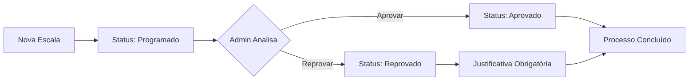

# Instruções: Implementação de Status e Justificativa nas Escalas Médicas

## 📋 Resumo da Funcionalidade

Foi implementado um sistema de aprovação/reprovação para escalas médicas com os seguintes atributos:

- **Status**: Programado (padrão), Aprovado, Reprovado
- **Justificativa**: Campo obrigatório quando status = Reprovado

### Características:
✅ Apenas **administradores** podem alterar o status
✅ Status "Programado" é atribuído automaticamente ao criar uma nova escala
✅ Justificativa obrigatória para status "Reprovado"
✅ UI moderna com chips coloridos e interativos
✅ Tooltip mostrando justificativa para usuários não-admin

---

## 🗄️ Passo 1: Executar Migration no Banco de Dados

### Instruções:

1. **Acesse o Supabase Dashboard**
   - URL: https://supabase.com/dashboard
   - Navegue até o seu projeto

2. **Abra o SQL Editor**
   - No menu lateral, clique em **SQL Editor**
   - Clique em **New Query**

3. **Execute o Script de Migration**
   - Copie todo o conteúdo do arquivo `migration-status-escalas.sql`
   - Cole no editor SQL
   - Clique em **Run** para executar

### Script SQL:

```sql
-- Migration: Adicionar Status e Justificativa às Escalas Médicas

-- Adicionar coluna 'status' com valor padrão 'Programado'
ALTER TABLE escalas_medicas
ADD COLUMN IF NOT EXISTS status TEXT NOT NULL DEFAULT 'Programado'
CHECK (status IN ('Programado', 'Aprovado', 'Reprovado'));

-- Adicionar coluna 'justificativa' (opcional, obrigatória quando status = 'Reprovado')
ALTER TABLE escalas_medicas
ADD COLUMN IF NOT EXISTS justificativa TEXT;

-- Criar índice para melhor performance nas queries por status
CREATE INDEX IF NOT EXISTS idx_escalas_medicas_status ON escalas_medicas(status);

-- Comentários explicativos
COMMENT ON COLUMN escalas_medicas.status IS 'Status da escala: Programado (padrão), Aprovado, Reprovado';
COMMENT ON COLUMN escalas_medicas.justificativa IS 'Justificativa obrigatória quando status = Reprovado';

-- Atualizar escalas existentes para status 'Programado' (caso já existam)
UPDATE escalas_medicas SET status = 'Programado' WHERE status IS NULL;
```

4. **Verificar Execução**
   - Após executar, você deve ver uma mensagem de sucesso
   - Verifique se as colunas foram criadas:
     ```sql
     SELECT * FROM escalas_medicas LIMIT 1;
     ```

---

## 🎨 Passo 2: Funcionalidades da Interface

### Para Administradores:

1. **Visualizar Status**
   - Cada card de escala exibe um chip colorido com o status:
     - 🔵 **Programado** (azul) - Status inicial
     - ✅ **Aprovado** (verde) - Escala aprovada
     - ❌ **Reprovado** (vermelho) - Escala reprovada

2. **Alterar Status** (apenas admins)
   - Clique no chip de status do card
   - Será aberto um diálogo modal com:
     - Informações da escala
     - Seletor de status (chips clicáveis)
     - Campo de justificativa
     - Status atual

3. **Validação Automática**
   - Ao selecionar "Reprovado", o campo de justificativa se torna obrigatório
   - O botão "Salvar Status" fica desabilitado até preencher a justificativa
   - Para outros status, a justificativa é opcional

### Para Usuários Não-Admin:

- Visualizam o status em cada card (chip colorido)
- Podem ver a justificativa ao passar o mouse sobre o chip (tooltip)
- **Não podem** alterar o status (chip não é clicável)

---

## 🔧 Arquivos Modificados

### 1. **migration-status-escalas.sql** (NOVO)
- Script SQL para adicionar os campos no banco de dados

### 2. **src/types/database.types.ts**
- Adicionado tipo `StatusEscala`
- Atualizada interface `EscalaMedica` com campos `status` e `justificativa`

### 3. **src/pages/EscalasMedicas.tsx**
- Adicionados imports: `CheckCircle`, `Cancel`, `HourglassEmpty`, `StatusEscala`
- Adicionado hook `useAuth` para verificar permissões
- Adicionados estados para controle do diálogo de status
- Função `getStatusConfig()` - Retorna configuração visual por status
- Função `handleOpenStatusDialog()` - Abre diálogo de edição
- Função `handleCloseStatusDialog()` - Fecha diálogo
- Função `handleSaveStatus()` - Salva alteração com validação
- Atualizado `handleSave()` - Define status padrão "Programado" ao criar
- Atualizado card de exibição - Exibe chip de status clicável (admins)
- Adicionado novo Dialog "Alterar Status"

---

## 🎯 Como Testar

### Cenário 1: Criar Nova Escala
1. Acesse a página "Escalas Médicas"
2. Clique em "Nova Escala"
3. Preencha os dados e salve
4. **Resultado esperado**: A escala é criada com status "Programado" (chip azul)

### Cenário 2: Aprovar Escala (Admin)
1. Clique no chip de status "Programado" de uma escala
2. Selecione o status "Aprovado" (chip verde)
3. Opcionalmente adicione uma justificativa
4. Clique em "Salvar Status"
5. **Resultado esperado**: O chip do card muda para verde "Aprovado"

### Cenário 3: Reprovar Escala (Admin)
1. Clique no chip de status de uma escala
2. Selecione o status "Reprovado" (chip vermelho)
3. **Tente salvar sem justificativa**
   - **Resultado esperado**: Campo fica vermelho e botão desabilitado
4. Preencha a justificativa
5. Clique em "Salvar Status"
6. **Resultado esperado**: O chip do card muda para vermelho "Reprovado"

### Cenário 4: Visualizar Justificativa (Não-Admin)
1. Como usuário não-admin (ou deslogado do admin)
2. Passe o mouse sobre um chip de status com justificativa
3. **Resultado esperado**: Tooltip exibe a justificativa

### Cenário 5: Validação de Permissão
1. Como usuário não-admin, tente clicar em um chip de status
2. **Resultado esperado**: Nada acontece (chip não é clicável)

---

## 🐛 Troubleshooting

### Erro: "Column 'status' does not exist"
**Solução**: Execute o script de migration no Supabase SQL Editor

### Erro: "Failed to update status"
**Solução**: Verifique as permissões RLS no Supabase:
```sql
-- Admins podem atualizar status
CREATE POLICY "Admins podem atualizar escalas"
ON escalas_medicas FOR UPDATE
USING (
  EXISTS (
    SELECT 1 FROM usuarios
    WHERE id = auth.uid()
    AND tipo IN ('administrador-agir-corporativo', 'administrador-agir-planta')
  )
);
```

### Chip de Status não aparece
**Solução**:
1. Verifique se a migration foi executada
2. Verifique se as escalas existentes têm o campo `status` populado:
   ```sql
   UPDATE escalas_medicas SET status = 'Programado' WHERE status IS NULL;
   ```

### Botão "Salvar Status" está desabilitado
**Solução**:
- Se o status selecionado é "Reprovado", preencha o campo de justificativa
- A justificativa é obrigatória apenas para status "Reprovado"

---

## 📊 Estrutura do Banco de Dados

### Tabela: `escalas_medicas`

| Coluna | Tipo | Descrição | Obrigatório |
|--------|------|-----------|-------------|
| `status` | TEXT | Status da escala (Programado, Aprovado, Reprovado) | Sim (padrão: Programado) |
| `justificativa` | TEXT | Justificativa da alteração de status | Não (obrigatório se status = Reprovado) |

### Constraints:
- `status` deve ser um dos valores: 'Programado', 'Aprovado', 'Reprovado'
- Índice criado em `status` para melhor performance

---

## 🎨 Design System

### Cores por Status:

| Status | Cor | Ícone | MUI Color |
|--------|-----|-------|-----------|
| Programado | Azul (#0ea5e9) | ⏳ HourglassEmpty | info |
| Aprovado | Verde (#10b981) | ✅ CheckCircle | success |
| Reprovado | Vermelho (#ef4444) | ❌ Cancel | error |

### Animações:
- **Hover no chip (admin)**: Scale 1.05 + Box Shadow
- **Transição**: All 0.2s ease

---

## ✅ Checklist de Implantação

- [ ] Executar migration SQL no Supabase
- [ ] Verificar criação das colunas `status` e `justificativa`
- [ ] Atualizar escalas existentes para status "Programado"
- [ ] Reiniciar aplicação (npm run dev)
- [ ] Testar criação de nova escala (status padrão = Programado)
- [ ] Testar alteração de status como admin
- [ ] Testar validação de justificativa obrigatória
- [ ] Testar visualização como não-admin
- [ ] Verificar permissões RLS no Supabase

---

## 📚 Documentação Adicional

### Fluxo de Aprovação:



---

## 🤝 Suporte

Em caso de dúvidas ou problemas:
1. Verifique se a migration foi executada corretamente
2. Verifique os logs do navegador (F12 > Console)
3. Verifique as políticas RLS no Supabase
4. Contate o desenvolvedor responsável

---

**Última atualização**: 2025-11-05
**Versão**: 1.0.0
